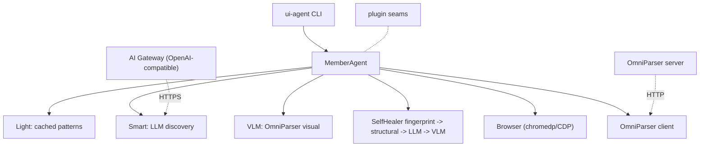

# uiauto-framework

[](https://github.com/nfsarch33/uiauto-framework/actions/workflows/ci.yml)
[](https://github.com/nfsarch33/uiauto-framework/actions/workflows/lint.yml)
[](https://github.com/nfsarch33/uiauto-framework/actions/workflows/codeql.yml)
[](LICENSE)

A Go-based, generic, self-healing UI automation framework with multi-tier model
routing, OmniParser visual grounding, and natural-language scenarios.

## Why

Traditional UI tests break the moment a selector changes. `uiauto-framework`
adds three layers between your scenario and the browser:

1. **Light tier** -- a fingerprint-cached executor that replays known-good
   selectors instantly.
2. **Smart tier** -- an LLM-powered discovery loop that re-resolves selectors
   when the cached pattern fails (structural match, then DOM-aware reasoning).
3. **VLM tier** -- visual scoring against an OmniParser-annotated screenshot
   when the DOM is ambiguous.

A `SelfHealer` orchestrates the tiers automatically. Scenarios are written in
plain English with parallel `action_types` (`click | type | verify | wait |
frame | evaluate | read`), so non-engineers can author and review them.

## Architecture



## Plugin seams

The `pkg/uiauto/plugin` package exposes four extension points so the framework
adapts to any web target:

- `ActionRegistry` -- register custom action types beyond the built-ins.
- `ScenarioLoader` -- parse scenarios from JSON, YAML, browser test specs,
  end-to-end test files, or any other source.
- `AuthProvider` -- run target-specific auth (OAuth, API keys, password
  manager autofill via CDP, SSO redirects).
- `VisualVerifier` -- pluggable visual scoring (OmniParser is the default;
  GPT-4V or any VLM can substitute).

See [docs/plugin-guide.md](docs/plugin-guide.md) for example implementations.

## Quick start

```bash
# 1. Build the CLI
make build

# 2. Run example.com smoke
make smoke
```

The `smoke` target launches Chrome on `:9222`, runs the
[examples/example-com-smoke/scenario.json](examples/example-com-smoke/scenario.json)
scenario, and writes annotated screenshots to `~/uiauto/tests/`.

For a richer local demo that types into a form and waits for an async result:

```bash
make form-smoke
```

See [examples/form-flow](examples/form-flow) for the exact HTML page and
scenario JSON.

Run artifacts and telemetry fields are documented in
[docs/observability.md](docs/observability.md).

## Install from source

```bash
go install github.com/nfsarch33/uiauto-framework/cmd/ui-agent@latest
```

Tagged releases also publish checksummed `ui-agent` binaries through GitHub
Releases.

## Scenario format

```json
[{
  "id": "smoke-001",
  "name": "Example.com smoke",
  "natural_language": ["Verify heading", "Click more info"],
  "selectors_used": ["h1", "a[href*=\"iana.org\"]"],
  "action_types": ["verify", "click"],
  "action_values": ["", ""]
}]
```

Full reference: [docs/scenario-format.md](docs/scenario-format.md).

## Repository layout

```
pkg/
  uiauto/      # core framework: agents, tiers, healer, browser, plugin seams
  llm/         # LLM client adapters (OpenAI, Bedrock, Claude CLI)
  evolver/     # capability mutation + auto-promotion
  domheal/     # DOM-level drift detection helpers
cmd/
  ui-agent/    # CLI binary for running scenarios
examples/
  example-com-smoke/   # public smoke scenario
docs/
  architecture.md
  observability.md
  plugin-guide.md
  scenario-format.md
```

## Requirements

- Go 1.24+
- Chrome / Chromium (for chromedp). For visible demos, launch with
  `--remote-debugging-port=9222`.
- Optional: an [OmniParser V2](https://github.com/microsoft/OmniParser) server
  for visual annotations and verifications.
- Optional: an OpenAI-compatible LLM endpoint for the Smart tier.

## Quality gates

```bash
make lint
make test
make test-integration
make ossready
```

`make test` is the fast, short-mode unit suite. `make test-integration` starts
the Docker Compose stack for browser, Postgres, and OmniParser-compatible
integration coverage.

## Roadmap

- Stabilize the public Go API before `v1.0.0`.
- Expand visual verification adapters beyond the default OmniParser client.
- Add more browser-backend adapters behind the existing `Browser` interface.
- Publish curated example suites for forms, dashboards, iframes, and visual
  drift recovery.

## License

Apache-2.0. See [LICENSE](LICENSE).

## Project status

Early-access reference implementation. APIs may change before the first tagged
release. Issues and PRs welcome.
