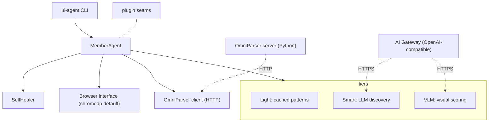

# Architecture

uiauto-framework is a layered Go library for self-healing UI automation.
Components communicate through narrow Go interfaces so each can be replaced
without touching the rest.

## Layers

## Core types

| Component | Path | Responsibility |
|---|---|---|
| `MemberAgent` | `pkg/uiauto/member_agent.go` | Top-level orchestrator. Owns the browser, healer, tiers, and pattern tracker. |
| `LightExecutor` | `pkg/uiauto/light_executor.go` | Cached fast path. Implements `click | type | verify | wait | frame | evaluate | read`. |
| `SmartDiscovery` | `pkg/uiauto/smart_discovery.go` | LLM-driven selector discovery when the cached path fails. |
| `SelfHealer` | `pkg/uiauto/self_healer.go` | Coordinates fingerprint -> structural -> LLM -> VLM heal paths. |
| `BrowserAgent` | `pkg/uiauto/browser.go` | chromedp implementation of the `Browser` interface. |
| `omniparser.Client` | `pkg/uiauto/omniparser/client.go` | HTTP client for the OmniParser server. |

## Data flow per step

1. `ui-agent` reads the next NL step + action type from the scenario.
2. `MemberAgent.RunTask` consults the pattern tracker for a cached selector.
3. If hit, the Light tier executes via `Browser`. Done.
4. If miss, the SelfHealer escalates: structural match -> Smart LLM call ->
   VLM scoring against an OmniParser-annotated screenshot.
5. The successful selector is written back to the tracker so subsequent runs
   stay on the Light tier.
6. Per-step JSON metrics + screenshots are appended to the run directory.

## Plugin seams

The framework stays generic by routing target-specific behaviour through
`pkg/uiauto/plugin`:

- `ActionRegistry` -- register custom action types.
- `ScenarioLoader` -- read scenarios from any source.
- `AuthProvider` -- handle target authentication.
- `VisualVerifier` -- swap out the visual scorer.

See [plugin-guide.md](plugin-guide.md) for examples.
