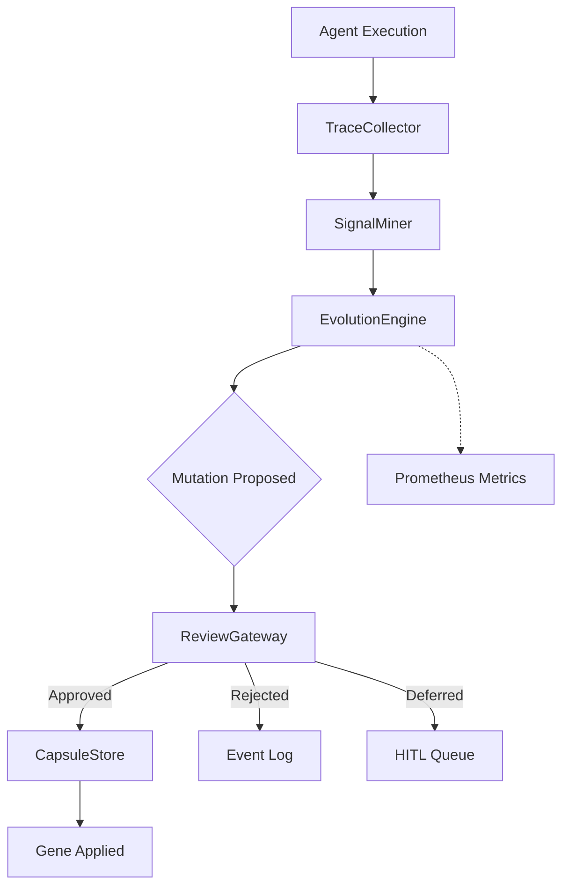

# evolver — EvoMap Agent Self-Evolution

The `evolver` package enables IronClaw agents to self-improve through a
controlled evolution pipeline: observe execution traces, detect anomalous
signals, synthesise mutations (with optional LLM assistance), and apply
approved changes through a human-in-the-loop review gateway.

## Architecture



## Components

| Component | File | Purpose |
|-----------|------|---------|
| Gene, Capsule, Mutation | `schema.go` | Core data types with validation |
| TraceCollector | `trace_collector.go` | Captures execution traces to JSONL |
| SignalMiner | `signal_miner.go` | Detects anomalies: repeated failures, latency, cost spikes, low success |
| EvolutionEngine | `engine.go` | Meta-agent: matches genes to signals, synthesises mutations via LLM |
| CapsuleStore | `store.go` | Git-friendly filesystem persistence for capsules, genes, events |
| ReviewGateway | `review.go` | HITL review with auto-approve for low-risk mutations |
| EvolverMetrics | `metrics.go` | Prometheus counters, histograms for mutations, signals, engine runs |

## Evolution Modes

| Mode | Behaviour |
|------|-----------|
| `repair_only` | Only processes failure and latency signals |
| `harden` | Repair + cost optimisation |
| `balanced` | All signal types (default) |
| `innovate` | All signals + proactive improvement |

## Signal Types

- **repeated_failure** — Same tool fails multiple times in a window
- **high_latency** — Execution time exceeds configured threshold
- **cost_spike** — Cost exceeds N× the average
- **low_success_rate** — Overall success rate drops below threshold

## Risk Levels

Mutations are tagged with blast radius risk: `low`, `medium`, `high`, `critical`.
The `AutoApproveReviewer` auto-approves up to a configurable threshold.

## Testing

```bash
# Unit tests
go test -short ./internal/evolver/...

# Verbose
go test -short -v ./internal/evolver/...

# With coverage
go test -short -coverprofile=cover.out ./internal/evolver/...
```

## Usage Example

```go
tc := evolver.NewTraceCollector("/tmp/traces.jsonl")
tc.Record(evolver.ExecutionTrace{ID: "t1", ToolName: "web_fetch", Success: true})
traces := tc.Flush()

miner := evolver.NewSignalMiner(evolver.DefaultSignalMinerConfig())
signals := miner.Mine(traces)

engine := evolver.NewEvolutionEngine(evolver.DefaultEngineConfig(), nil)
mutations := engine.Evolve(signals)

store, _ := evolver.NewCapsuleStore("/tmp/evomap")
reviewer := &evolver.AutoApproveReviewer{MaxAutoApproveRisk: evolver.RiskMedium}
gw := evolver.NewReviewGateway(reviewer, store)
responses, _ := gw.ProcessMutations(ctx, mutations)
```
